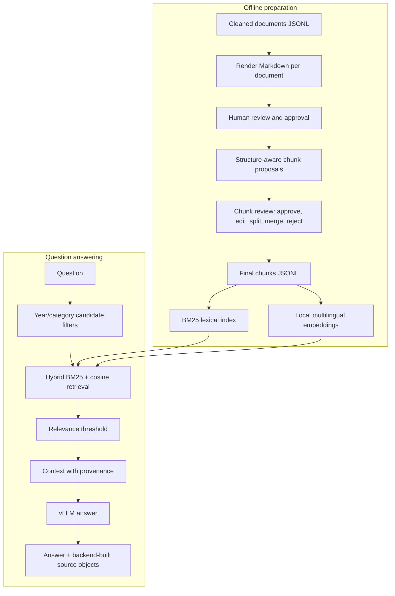

# HaUI RAG pipeline

The RAG code stays in Python modules and scripts; notebooks are optional
experiments, never the production pipeline.

## Architecture



`data/documents/*.jsonl` remains the machine-readable source of truth. Review
Markdown is an editing surface for the document's `content`; document workflow
state is stored separately in `data/workflow/documents.json`. Chunk proposals
and review decisions are also separate from source documents.

## Setup

```bash
uv sync
cp .env.example .env
```

The first semantic query downloads the configured multilingual embedding model
to the local Hugging Face cache. Model weights and generated vector indexes are
not committed. Configure `RAG_EMBEDDING_MODEL` only with a model supported by
FastEmbed. vLLM chat settings are `VLLM_BASE_URL`, `VLLM_MODEL`, and optionally
`VLLM_API_KEY`.

## Review one document independently

Open the resumable terminal review menu:

```bash
uv run python -m rag.cli review
```

Choose documents or chunks, then choose one of the 14 categories before seeing
that category's items. The picker displays ten at a time; enter `>` or `<` to
page and type a document/chunk ID, title, or text to filter. The displayed
numbers refer to the current filtered list, so later pages are reachable and
search is not limited to the first 20 records.

Documents are rendered to Markdown and opened in VS Code as a detached process
(`code --reuse-window`), so the terminal remains available and the Electron
warning messages do not pollute it. Save the Markdown in VS Code, switch back
to the terminal, then approve and save (`a`), save edits but leave pending
(`e`), reject (`r`), skip (`n`), or quit. Reject/skip do not apply unsaved
Markdown edits to source JSONL. Set `VISUAL` or `EDITOR` to override the
default opener.

The chunk menu distinguishes pending proposals from approved/final chunks.
Approved chunks may still be edited; the CLI re-finalizes that document after
the edit, and retrieval refreshes its local embedding index automatically.
If a document has unresolved chunk proposals, the edit is saved as a review
decision but final chunks remain unchanged until those proposals are resolved.

Render just the document being reviewed:

```bash
uv run python -m rag.cli render --document 05_tuition_scholarship_001
```

Edit only the content between the markers in
`data/review/05_tuition_scholarship/05_tuition_scholarship_001.md`, then apply
the edited content to the source JSONL:

```bash
uv run python scripts/apply_review.py \
  data/documents/05_tuition_scholarship.jsonl \
  data/review/05_tuition_scholarship
uv run python scripts/validate.py
```

Applying a review puts that document in `review_pending`; it does not silently
approve it. Approve or reject it explicitly:

```bash
uv run python -m rag.cli document-review status --document 05_tuition_scholarship_001
uv run python -m rag.cli document-review approve --document 05_tuition_scholarship_001
```

Other documents remain at their own status and can be reviewed in parallel.
The workflow states (`cleaned`, `review_pending`, `approved`, `rejected`,
`chunk_proposed`, `chunk_review`, `final`, `indexed`) do not replace the corpus
`status` field (`active`/`archived`).

## Propose, review, and finalize chunks

Chunk only an approved document:

```bash
uv run python -m rag.cli chunk --document 05_tuition_scholarship_001
```

Proposals are written to `data/chunks/proposals/<category>.jsonl`. They carry
document/source IDs, title, URL, category, year, heading path, source position,
content type, optional structured content, text, review status, and override
fields. The chunker groups structural blocks and only falls back to sentence
boundaries for long paragraphs; long tables and indivisible sentences are kept
intact rather than cut at an arbitrary character boundary.

Inspect the proposal file, then decide each proposal. An edit is stored in
`text_override`; it does not rewrite the source document:

```bash
uv run python -m rag.cli chunk-review approve \
  --input data/chunks/proposals/05_tuition_scholarship.jsonl \
  --chunk-id 05_tuition_scholarship_001__section-001__chunk-001

uv run python -m rag.cli chunk-review edit \
  --input data/chunks/proposals/05_tuition_scholarship.jsonl \
  --chunk-id 05_tuition_scholarship_001__section-001__chunk-001 \
  --text-file /path/to/revised-chunk.txt
```

Other actions:

```bash
uv run python -m rag.cli chunk-review split \
  --input data/chunks/proposals/05_tuition_scholarship.jsonl \
  --chunk-id <chunk-id> --text-file /path/to/two-parts.txt

uv run python -m rag.cli chunk-review merge \
  --input data/chunks/proposals/05_tuition_scholarship.jsonl \
  --chunk-id <first-id> --other-chunk-id <second-id>

uv run python -m rag.cli chunk-review reject \
  --input data/chunks/proposals/05_tuition_scholarship.jsonl \
  --chunk-id <chunk-id> --note "Reason for rejection"
```

For `split`, the text file contains two non-empty parts separated by a line
exactly equal to `---CHUNK-SPLIT---`. The original chunk becomes `split`
(superseded), and two new pending proposals are created with `__a` and `__b`
suffixes. Review those child proposals separately; only approved or edited
children are eligible for final output.

For `merge`, the two source chunks must belong to the same document. Their text
and provenance are combined into a new pending proposal; the originals become
`merged` (superseded). Review the merged proposal separately.

Rejecting a chunk marks only that proposal `rejected` and records the optional
reason. It is excluded from final output; it does not delete or modify the
source document or other chunks. Rejecting a document instead sets its
workflow state to `rejected`, so it cannot be chunked until explicitly reviewed
again. Neither action removes the document from source JSONL.

Once every proposal (including split/merged replacements) has a decision,
promote the approved/edited chunks:

```bash
uv run python -m rag.cli finalize-chunks \
  --input data/chunks/proposals/05_tuition_scholarship.jsonl \
  --document 05_tuition_scholarship_001
```

If the source document changes and must be re-chunked, old decisions for that
document are not silently reused. Explicitly drop that document's obsolete
review records:

```bash
uv run python -m rag.cli chunk --document 05_tuition_scholarship_001 --replace-review
```

Final chunks are written to `data/chunks/final/`. Rejected or superseded
proposals are excluded. Finalization also invalidates neither source text nor
other documents' work; changing a document's review state makes its old final
chunks ineligible for retrieval until new chunks are finalized.

## Index and retrieve

BM25 is computed in memory from final chunks; semantic vectors use the configured local
multilingual sentence-embedding model. The hybrid score is:

```text
score = alpha * cosine_similarity + (1 - alpha) * (BM25 / max_BM25_for_query)
```

`RAG_ALPHA`, `RAG_SCORE_THRESHOLD`, and `RAG_MIN_TERM_COVERAGE` (default `0.3`) control fusion
and relevance filtering. An explicit year is a strict filter: if no final
chunk has that year, retrieval returns no sources instead of silently using a
nearby year. Common query phrases can also constrain category.

Build or update the local persistent vector index:

```bash
uv run python -m rag.cli index --document 05_tuition_scholarship_001
uv run python -m rag.cli index --all
```

The first query builds the index automatically if it is absent, and retrieval
updates vectors whose final chunk text changed. The explicit index command is
useful to prebuild vectors before serving queries. Index files live in ignored
`data/indexes/` and can be regenerated from final chunks.

Retrieval-only and full RAG:

```bash
uv run python -m rag.cli retrieve --query "Học bổng mức 1 năm 2026 yêu cầu điều kiện gì?"

uv run python -m rag.cli --query \
  "Học bổng mức 1 năm 2026 yêu cầu điều kiện gì?" --show-context
```

The old `--query` invocation remains supported. The supported subcommand form
is `uv run python -m rag.cli query --query "..." --show-context`.

Generation receives provenance-labelled context and is told not to invent
facts, use another year's data as the answer, or generate citation numbers. The
backend constructs `sources` from retrieved chunks (`source_id`, `chunk_id`,
title, URL, year, category, score). When the relevance filter rejects all
candidates, generation is skipped and `sources` is empty.

## Evaluation and extension

Add one JSON object per line to `evaluation/questions.jsonl`. A case can contain
`question`, `expected_document_ids`, `expected_chunk_ids`, `expected_year`, and
`notes`. `rag/test_questions.json` remains supported for the original basic
evaluation.

Useful checks:

```bash
uv run python -m unittest discover -s tests -v
uv run python -m rag.evaluate
```

The sample cases in `evaluation/questions.jsonl` include year-specific
cutoff-score questions, scholarship, tuition, admission methods, a no-match
query, and a query without an explicit year. Add validated final chunks for a
document before expecting it to appear in retrieval.

No vector database server, LLM reranker, agentic retrieval, or FE rendering is
part of this baseline.
